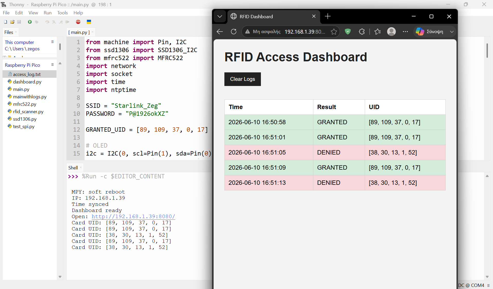

# RFID Access Control System – Raspberry Pi Pico W

## Overview

This project is an RFID-based access control system developed using Raspberry Pi Pico W and MicroPython.

The system authenticates RFID cards and key fobs, displays access status on an OLED screen, provides visual and audio feedback through LEDs and a buzzer, logs events, and hosts a Wi-Fi dashboard for monitoring access attempts.

## Features

* RFID card authentication (RC522)
* OLED status display
* Green LED for authorized access
* Red LED for denied access
* Buzzer notifications
* Access logging
* Wi-Fi connectivity
* Web dashboard
* Log management (Clear Logs)

## Hardware Used

* Raspberry Pi Pico W
* RC522 RFID Reader
* SSD1306 OLED Display
* Breadboard
* RFID Card
* RFID Key Fob
* LEDs
* Buzzer
* Jumper Wires

## Dashboard

The system provides a web dashboard showing:

* Access time
* Authentication result
* Card UID
* Log management

## Project Images

Hardware setup, access control demonstrations, and dashboard screenshots are included in the repository.

## Technologies

* MicroPython
* Raspberry Pi Pico W
* RFID (RC522)
* I2C OLED Display
* Wi-Fi Networking
* Embedded Systems

## Author

Christos Zegos
